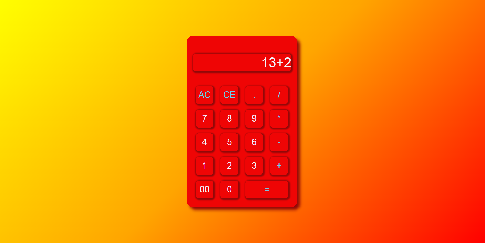

# Calculator App

Welcome to the calculator app! This web application allows you to perform basic arithmatic calculations in your browser.

## Features
Addition , Substraction, Multiplication , Division.

AC button can be use to reset the input and start a new calculation.

CE button allow user to delete the last entered value.

Responsive design for a seamless experience on different devices.

## Image of calculator 
   

## Usage
1. Click the numbers and click the operation buttons to perform calculations.
2. Click "=" button to see the result.

3.Click AC button to reset the input and CE button to delete the last entered value.

## Technologies Used
HTML , CSS , JAVASCRIPT